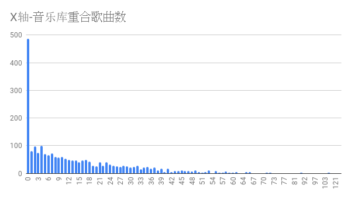
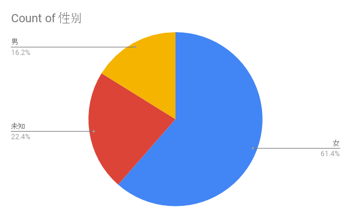
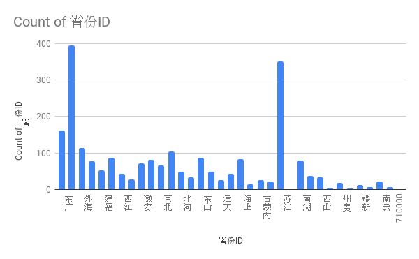
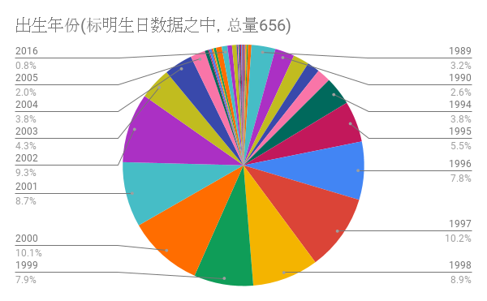

# NeteaseMusicMatch2018
网易云音乐”一歌一遇“批量获取分析

## 1.appCrawlandSave.py:
需要手机adb支持，运行脚本实现自动点击并保存网易”一歌一遇“匹配用户

## 2.extractUser.py:
根据上一步保存的xml文件进行解析，抽取出用户名列表

## 3.UsernameToInfoJson.py:
根据上一步抽取出的用户列表，获取用户基本信息,比较歌单重合歌曲数量（需登录）保存为csv文件 和 Json文件

`"用户名","ID","主页地址","生日","性别","等级","听歌数目","省份ID","城市ID","个性签名","社交网络","相同歌曲数目","共同歌曲列表"`

需要配合隔壁的api：

[NeteaseCloudMusicApi](https://github.com/Binaryify/NeteaseCloudMusicApi)

## 4.个人测试结果：
根据自己账户匹配了 2291+150 个用户(__因为被举报3次被封禁了，的确这种爬取其实不太友好,初衷只是想做一个实验，向不幸匹配到我的用户致歉🙇__),150个为机器人，无法查找到相应ID，根据观察这些机器人的行为特征是匹配到以后马上自动退出。
结果如下：(本人歌曲喜好偏古风，二次元，肥宅，洛天依)

从结果来看猜测网易的匹配只是根据同一时间寻找的用户之间匹配，其次是从中匹配相同曲风类型。

通过自己曲库中的740首歌跟目标用户的所有歌单进行匹配，最多只有157首重合，大部分是0重合。
## 5.改进以及思考

* 本代码因为时间有限，很多地方还有优化空间，包括取得用户信息的部分可以尝试多线程

* 从重合歌曲较高的用户的社交网络以及歌单分析，于本人的喜好基本符合（这个是一个好消息🤔）

* 网易云音乐另一个功能是可以获取10分钟之内听过同一首歌的用户，一个思路是如果通过不断监测自己歌单中相对小众的歌曲的听歌用户，再爬取这些用户的歌单，可能找到与自己歌单匹配度高的用户的概率更大（打算有空用Java写一下放服务器上跑）

